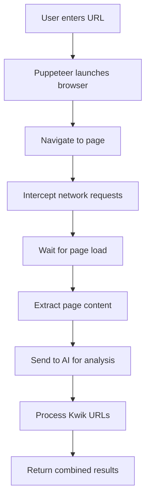

# AI-Powered Scraper Helper

A sophisticated web scraping tool that combines **Puppeteer** automation with **Google AI (Gemini)** analysis to extract streaming and download links from anime episode pages. The tool provides real-time logging via WebSocket and an intuitive web interface.

## 🚀 Features

- **AI-Powered Analysis**: Uses Google Gemini 2.0 Pro to analyze page content and extract streaming logic
- **Advanced Web Scraping**: Puppeteer-based scraping with request interception
- **Real-time Logging**: WebSocket-powered live log updates
- **Stream URL Extraction**: Automatically detects and processes Kwik.cx streaming URLs
- **Download Link Detection**: Extracts direct download links with quality and provider information
- **Modern UI**: Dark-themed interface with live updates and responsive design
- **Data Export**: Save analysis results as JSON mappings
- **Error Handling**: Comprehensive error handling with detailed logging

## 🛠️ Prerequisites

Before setting up the project, ensure you have:

- **Node.js** (v16 or higher)
- **npm** or **yarn** package manager
- **Google AI API Key** (for Gemini integration)
- **Chrome/Chromium** browser (for Puppeteer)

## 📦 Installation

1. **Clone the repository**:
   ```bash
   git clone <repository-url>
   cd ai-scraper-helper
   ```

2. **Install dependencies**:
   ```bash
   npm install
   ```

3. **Install required packages**:
   ```bash
   npm install puppeteer-core express ws genkit @genkit-ai/googleai zod
   ```

4. **Set up environment variables**:
   Create a `.env` file in the root directory:
   ```env
   GOOGLE_API_KEY=your_google_ai_api_key_here
   PUPPETEER_EXECUTABLE_PATH=/path/to/chrome/or/chromium
   ```

## 🔧 Configuration

### Google AI API Setup

1. Visit [Google AI Studio](https://makersuite.google.com/app/apikey)
2. Create a new API key
3. Add the key to your `.env` file as `GOOGLE_API_KEY`

### Puppeteer Setup

The tool uses `puppeteer-core` which requires you to specify a Chrome/Chromium executable path:

**Windows**:
```env
PUPPETEER_EXECUTABLE_PATH=C:\Program Files\Google\Chrome\Application\chrome.exe
```

**macOS**:
```env
PUPPETEER_EXECUTABLE_PATH=/Applications/Google Chrome.app/Contents/MacOS/Google Chrome
```

**Linux**:
```env
PUPPETEER_EXECUTABLE_PATH=/usr/bin/google-chrome
```

## 🚀 Usage

### Starting the Application

1. **Start the Genkit development server** (in one terminal):
   ```bash
   npx genkit start
   ```

2. **Start the main server** (in another terminal):
   ```bash
   node server.js
   ```

3. **Open your browser** and navigate to:
   ```
   http://localhost:3001
   ```

### Using the Web Interface

1. **Enter a URL**: Paste an anime episode URL in the input field
2. **Click "Analyze with AI"**: The system will:
   - Launch Puppeteer to scrape the page
   - Intercept network requests for streaming URLs
   - Send page content to AI for analysis
   - Extract download links and streaming logic
3. **View Results**: Analysis results appear in real-time
4. **Save Data**: Export the complete analysis as JSON

### API Endpoints

- `GET /`: Serves the main web interface
- `GET /scrape?url=<episode_url>`: Scrapes and analyzes a given URL
- `POST /save`: Saves analysis data to `mapping.json`

## 📁 Project Structure

```
ai-scraper-helper/
├── ai/
│   ├── flow.js          # AI analysis flow using Genkit
│   └── genkit.js        # Genkit configuration
├── server.js            # Express server with WebSocket support
├── scraper.js           # Puppeteer scraping logic
├── index.html           # Web interface
├── .env                 # Environment variables
├── package.json         # Dependencies
└── README.md           # This file
```

## 🧠 How It Works

### 1. Web Scraping Process



### 2. AI Analysis

The AI analyzes the HTML content to:
- **Identify streaming logic**: Detect obfuscated JavaScript, iframes, and dynamic loading
- **Extract download links**: Parse button text for quality, provider, and audio type
- **Understand page structure**: Analyze how video URLs are generated or embedded

### 3. Real-time Communication

- **WebSocket connection** provides live logging updates
- **Bidirectional communication** between server and client
- **Error handling** with automatic reconnection attempts

## 🎯 Supported Sites

The tool is designed to work with anime streaming sites that use:
- **Kwik.cx** streaming service
- **Standard download buttons** with quality indicators
- **JavaScript-based** video loading
- **iframe-embedded** players

## 📊 Output Format

The tool returns structured data including:

```json
{
  "analysis": {
    "streamingLogic": "Description of how streaming URLs are generated...",
    "downloadLinks": [
      {
        "provider": "WAP",
        "quality": "720p",
        "audio": "sub",
        "url": "https://example.com/download"
      }
    ]
  },
  "kwik": {
    "urls": ["https://kwik.cx/..."],
    "sources": [
      {
        "originalUrl": "https://kwik.cx/...",
        "m3u8": "https://example.com/stream.m3u8"
      }
    ]
  },
  "referrer": "https://animepahe.ru/..."
}
```

## 🐛 Troubleshooting

### Common Issues

1. **"AI service is not yet available"**
   - Ensure Genkit server is running (`npx genkit start`)
   - Check Google AI API key is valid

2. **"Browser launch failed"**
   - Verify `PUPPETEER_EXECUTABLE_PATH` is correct
   - Install Chrome/Chromium if missing

3. **"No Kwik URLs intercepted"**
   - Page may not contain expected streaming URLs
   - Check if site structure has changed

4. **WebSocket connection issues**
   - Refresh the page to reconnect
   - Check if port 3001 is available

### Debug Mode

Enable detailed logging by setting:
```env
DEBUG=puppeteer:*,genkit:*
```

## 🔒 Legal & Ethical Considerations

This tool is designed for educational and research purposes. Users are responsible for:
- **Respecting website terms of service**
- **Following copyright laws**
- **Using scraped data responsibly**
- **Not overwhelming target servers**

## 🤝 Contributing

1. Fork the repository
2. Create a feature branch (`git checkout -b feature/amazing-feature`)
3. Commit your changes (`git commit -m 'Add amazing feature'`)
4. Push to the branch (`git push origin feature/amazing-feature`)
5. Open a Pull Request

## 📋 TODO / Future Improvements

- [ ] Support for additional streaming providers
- [ ] Rate limiting and queue management
- [ ] Database integration for storing analysis results
- [ ] User authentication and session management
- [ ] Batch processing capabilities
- [ ] Mobile-responsive improvements
- [ ] Export options (CSV, Excel)
- [ ] Scheduled scraping tasks
- [ ] Advanced filtering and search
- [ ] Performance optimization

## 📄 License

This project is licensed under the MIT License. See the [LICENSE](LICENSE) file for details.

## 🙋 Support

For issues, questions, or contributions, please:
- Open an issue on GitHub
- Check existing issues for solutions
- Provide detailed error logs when reporting bugs

---

**Note**: This tool is for educational purposes. Always respect website terms of service and applicable laws when scraping web content.
